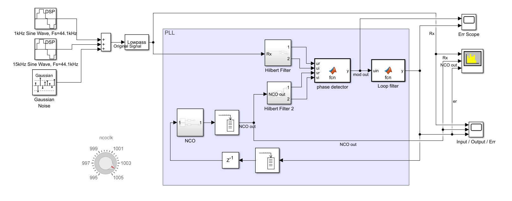

# Digital Phase Locked Loop tone tracking -- A simple example tracking sine waves using a digital phase-locked loop in Simulink®

## Overview
This model demonstrates a digital Phase-Locked Loop (PLL) designed to track the phase of a sinusoidal signal. The received input consists of two sinusoidal components with added noise. A user-adjustable dial is provided to set the frequency of a local oscillator, allowing for a ±0.5% frequency offset.
The PLL implementation includes a sinusoidal phase detector, a lead-lag loop filter, and a numerical controlled oscillator (NCO). For further discussion and detailed analysis, please refer to the accompanying Live Script file: pll_toneTrack.mlx.

## How to get started
Run the below line in Matlab:
>>PLL_toneTrack

## Relevant Industries
telecommunications equipments, wireless receivers, communications system design, wireless eqipment. 

## Relevant Products
 *  MATLAB®
 *  Simulink®
 *  DSP System Toolbox™ 

Copyright 2025 The MathWorks, Inc.
